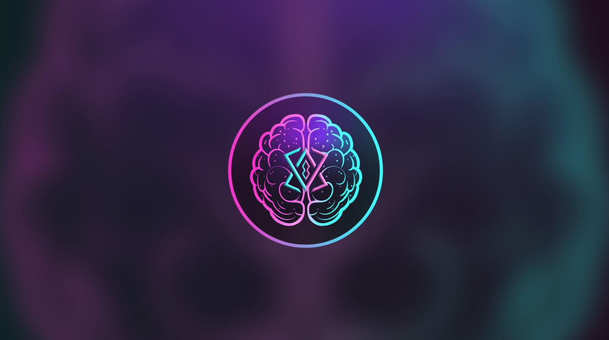

# Introduction
 
Brain is a platform aiming to redefine the metaverse experience, equipped with high security standards and fraud prevention mechanisms. This application, developed by BRN Metaverse Software Inc., offers users the opportunity to navigate, interact, and transact securely in digital environments. This document thoroughly explains the technical architecture, unique features, and development process standards of Brain.

## Objective
The primary goal of Brain is to ensure users have a safe, transparent, and smooth experience in the metaverse universe. It aims to secure users' digital assets and personal information by providing comprehensive protection against security threats such as fraud, identity theft, and data breaches. At the same time, it offers innovative tools and features to enrich the user experience and facilitate interaction.
