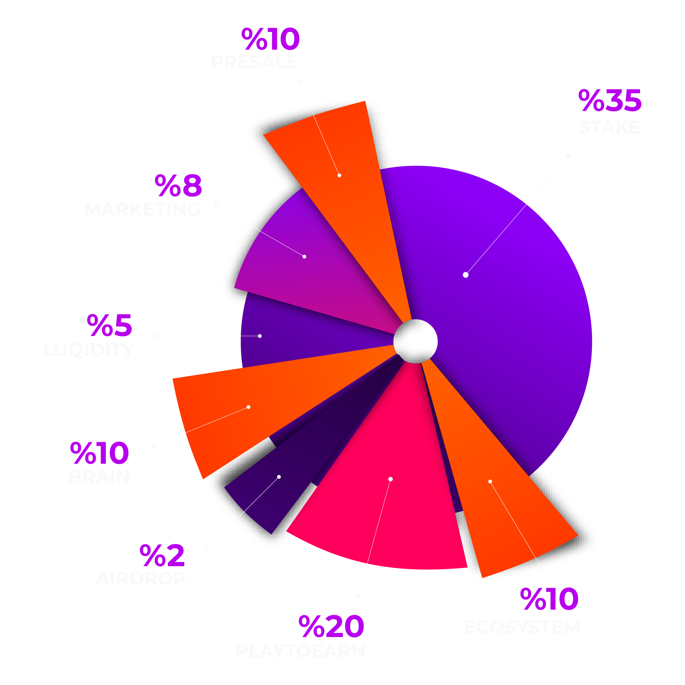

# Tokenomics

## **Maximum Supply**
**29.700.000 BRN** 

## **Total Supply**
**28.000.000 BRN**

## **Brain** 
The allocation here is aimed at initiatives that drive the technological and strategic brainpower behind the project, possibly funding innovation, research, and development within the BRN Metaverse. 

## **Marketing** 
A specific portion is designated for marketing to expand the community's reach, engage more users, and enhance brand visibility across various platforms.

## **Ecosystem** 
This allocation supports the overall health and functionality of the BRN ecosystem, funding various operational needs, ongoing development, and future expansions.

## **Play to Earn** 
Tokens dedicated to this segment are used to reward players within the BRN Metaverse, particularly in the 'Endless Rangers Awakening' game, enhancing user engagement and incentivizing gameplay.

## **Stake** 
This significant portion of tokens is reserved for staking purposes. Holders can stake their tokens to earn rewards, fostering long-term holding and stability within the token's ecosystem.

## **Liquidity** 
Reserved for ensuring sufficient liquidity on both decentralized and centralized exchanges, this helps in maintaining token stability and ensuring smoother trading experiences for users.

## **Airdrop** 
This small allocation is used for promotional airdrops to increase token distribution among potential new users and incentivize participation in the BRN ecosystem.
